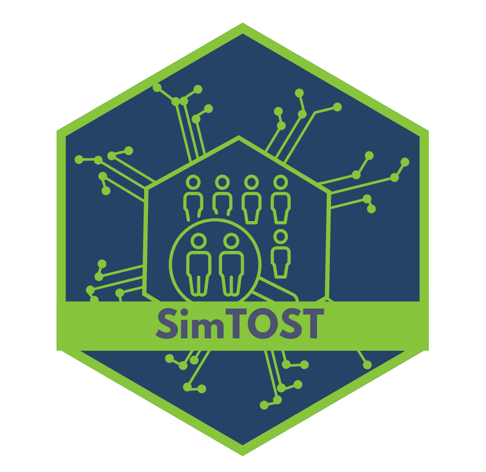

<!-- README.md is generated from README.Rmd. Please edit that file -->

# SimTOST 

<!-- badges: start -->

[](https://github.com/smartdata-analysis-and-statistics/SimTOST/actions/workflows/R-CMD-check.yml)
[](https://CRAN.R-project.org/package=SimTOST)
[](https://app.codecov.io/gh/smartdata-analysis-and-statistics/SimTOST?branch=main)
<!-- badges: end -->

The goal of `SimTOST` is to estimate the sample size sample size for a
randomized, three-arm, parallel group phase I trial via simulation.

## Installation

`SimTOST` is available on CRAN and can be installed by running the
following code.

``` r
install.packages("SimTOST")
```

You can also install the development version of SimTOST from
[GitHub](https://github.com/) with:

``` r
# install.packages("devtools")
devtools::install_github("smartdata-analysis-and-statistics/SimTOST")
```

## Example

The main features of this package is `calopt` function which can be used
to calculate sample size for individual and multiple endpoints.

The example of using the functionality of this package can be found in
these vignettes:

1.  [Sample size calculation of individual endpoint]()
2.  [Sample size calculation of multiple endpoints]()
